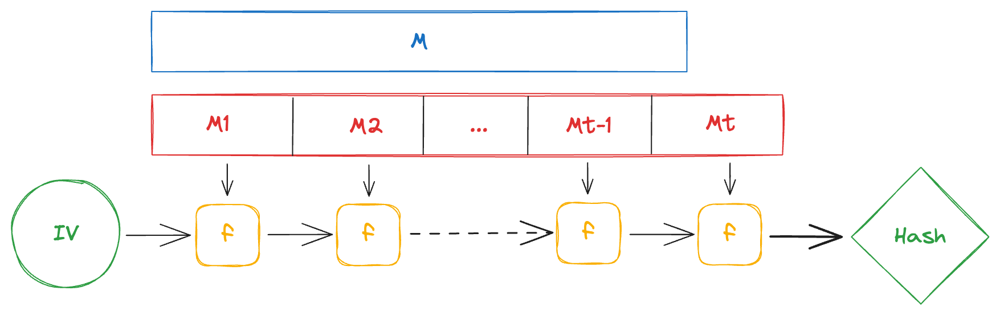

+++
title = 'Length Extension Attacks'
date = 2024-05-29
draft = false
tags = ['technical', 'cryptography']
math = true
+++

Cryptographic hash functions are indispensable building blocks in the field of cryptography, designed to fulfill essential security properties. Various families of cryptographic hash functions exist, each with its own construction mechanism and security guarantees. Among the potential vulnerabilities, the "Length Extension Attack" is particularly significant. Understanding this particular attack is not only crucial for mitigating certain security risks but also for making informed design choices in cryptographic systems.

# Cryptographic hash functions
Cryptographic hash functions typically generate a fixed-size output, known as a *digest*, from variable-length input data. The output is ideally unique (within reason) to each set of unique inputs and computationally infeasible to reverse-engineer. 
One of the most prevalent constructions for cryptographic hash functions is the *Merkle–Damgård construction*. This construction is utilized by many hash functions such as [MD5](https://en.wikipedia.org/wiki/MD5), [SHA-1](https://en.wikipedia.org/wiki/SHA-1), and the [SHA-2 family](https://en.wikipedia.org/wiki/SHA-2) (except for the truncated versions). **Functions employing this construction are inherently vulnerable to Length Extension Attacks.** 
To understand this attack, it's important to first understand how this construction works.

## Merkle–Damgård Construction

### Step 1: Padding
1. **Input message**: $M$ with arbitrary-length $|M|$.
2. **Padding scheme**: Use a padding scheme to extend $M$ so that its length is a multiple of a predetermined block size $n$. The padded message $M^{\prime}$ will often include the original message length $|M|$ to ensure unique hashes for each unique message. Typically, padding involves appending a '1' bit, followed by '0' bits, and the length of the original message in bits.
3. **Message blocks**: Divide $M^{\prime}$ into $t$ blocks $M_1, M_2, ... M_t$ each of $n$ bits.

$$M^{\prime} = M_1 \Vert M_2 \Vert ... \Vert M_t$$

### Step 2: Initialization
Define $H_0$ as the initialization vector (IV), a fixed-size (typically 128, 256, or 512 bits) constant value that is defined as part of the hash function's specification.

### Step 3: Iterate and compress
For each message block $M_i$, compute the hash $H_i$ using a compression function $f$. This function takes two fixed-size inputs: the current hash state $H_i$ and the message block $M_i$, and returns a fixed-size output $H_{i+1}$. The compression function $f$ can be expressed as:
1. **Concatenation**: Concatenate $H_i$ and $M_i$ obtaining $X$.
2. **Transformation**: Apply a sequence of operations $T$ to $X$ obtaining $Y$. The transformation $T$ is usually a complex sequence of bitwise operations and modular arithmetic.
3. **Reduction**: Finally, apply a reduction operation $R$ to the transformed $Y$. $R$ is designed to compress $Y$ back to a fixed-length output $H_{i+1}$. This could involve taking a subset of bits, applying additional bitwise operations, or summing up sections of $Y$.

So, the compression function $f$ can be expressed as the composition of concatenation, transformation, and reduction operations:
$$H_{i+1} = f(H_i, M_i) = R(T(H_i \Vert M_i))$$

### Step 4: Finalization
After all $t$ message blocks have been processed, the final hash value $H_t$ is the hash of the entire original message $M$
$$H(M)=H_t$$




# The Length Extension Attack
Length extension attacks exploit a property of the Merkle-Damgård construction that allows an attacker to compute the hash of some input plus additional data without knowing the original input.

**Prerequisites:**
- The underlying hash function uses the Merkle-Damgård construction without any mechanism to prevent length extension attacks.
- The attacker has access to the hash digest of the original message, $H(M)$.
- The attacker knows the exact length of the original message, $|M|$.

### Step 1: Appending New Data
The attacker chooses arbitrary data $D$ to append to the original message. The appended message will be added after the original padding. The overall forged message will also need padding, considering the original padded message length $|M^{\prime}|$ (which only depends on the length of the original message, $|M|$). The forged message will look like $M \Vert P \Vert D \Vert P^{\prime}$.

### Step 2: Hashing
The attacker extends the original digest by setting $H_0$ to the original digest $H(M)$ and hashing the new padded data $D \Vert P^{\prime}$. This results in $H(M^{\prime} \Vert D)$, successfuly extending the orignal hash, without knowing the contents of $M$.


## Example: Message Authentication Codes
This attack can be particularly problematic in a poorly designed MAC ([Message Authentication Code](https://en.wikipedia.org/wiki/Message_authentication_code)) system.

Suppose an authentication mechanism uses a secret key for each user (known only to each user and the server). To attest the authenticity of some data, users produce signatures using their secret key and a hash function:

$$
\begin{array}{l}
data = \ldots \\\\
Sig = H(secret \Vert data)
\end{array}
$$

The user sends both the data and the signature (the hash) to the server. The server hashes the received data (pre-appending the secret) and checks if it matches the signature.

If the hash function used relies on the Merkle-Damgård construction, this system is susceptible to a length extension attack. If the attacker knows the length of the secret (which can be brute-forced), it becomes trivial to compute the padding $P$ used. The attacker can then append any arbitrary data $D$ after the padding and compute the new hash, producing a valid signature without ever knowing the secret. The new data becomes:

$$
\begin{array}{l}
data^{\prime} = data \Vert P \Vert D \\\\
Sig^{\prime} = H(secret \Vert data^{\prime})
\end{array}
$$

In a real world scenario this could look something like:
```
data  = "dest_uid=21&amount=500"
data' = "dest_uid=21&amount=500||<..padding...>||&dest_uid=24"
```

## Mitigation
- **Using a HMAC**: [HMAC](https://en.wikipedia.org/wiki/HMAC)'s make use of a secret key to hash input (the same input with different keys will lead to different outputs). This process significantly alters the hash function's final state and thus it can't be extended without the knowledge of the secret key.
- **Switching to a different construction**: There are various other hashing functions based on different constructions, such as [SHA-3](https://en.wikipedia.org/wiki/SHA-3) based on a [sponge construction](https://en.wikipedia.org/wiki/Sponge_function)

Note that while [salting](https://en.wikipedia.org/wiki/Salt_(cryptography)) can be a useful technique to prevent other sorts of attacks, **it does not mitigate** Length Extension Attacks.
